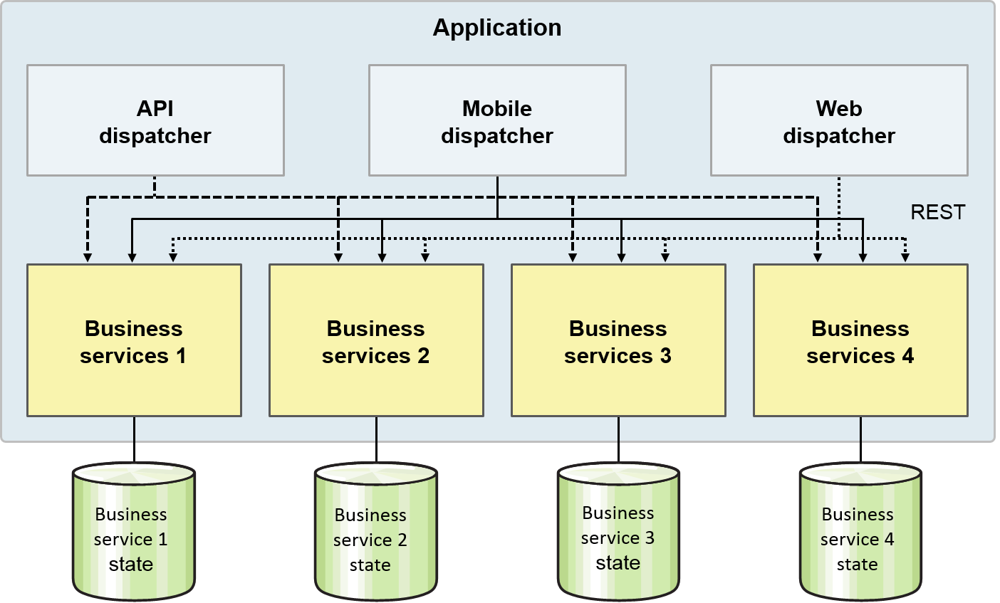

# Kubernetes and istio

## The twelve factors

To effectively design and build apps for the cloud, you should understand the twelve factors:

I. Codebase: One codebase tracked in revision control, many deployments

II. Dependencies: Explicitly declare and isolate dependencies

III. Config: Store configuration in the environment

IV. Backing services: Treat backing services as attached resources

V. Build, release, run: Strictly separate build and run stages

VI. Processes: Execute the app as one or more stateless processes

VII. Port binding: Export services via port binding

VIII. Concurrency: Scale out via the process model

IX. Disposability: Maximize robustness with fast startup and graceful shutdown

X. Dev/prod parity: Keep development, staging, and production as similar as possible

XI. Logs: Treat logs as event streams

XII. Admin processes: Run admin/management tasks as one-off processes

### Codebase

Use one codebase for all the code in your app, which is stored in a revision control system, supporting many deployments. For example, units of deployment could be Docker containers, Cloud Foundry apps, or a TAR file made up of a Helm chart.

Each microservice should have its own project with its own main branch and membership but should all be stored in the same repository.

Tip: To automate deployment, you can use popular tools such as Gradle or Jenkins.

### Dependencies

Explicitly declare and isolate your dependencies. This is common problem for many developers. Build packs take care of many of these dependencies for you. Never rely on systemwide dependencies. Here are typical language-specific configurations:

Node.js: Node Package Manager (npm)
Liberty: Feature manager
Ruby: Bundler
Java EE: Application resources
For example, a Node.js app is described by an npm package file (typically named package.json). Among other configuration details, it lists what other packages this package depends on. The app configuration is part of the app, and you manage the configuration in source control, for example, GitHub.

Another example is the server.xml file for WebSphere Liberty. The server is configured by its server.xml file. In that file, the Feature Manager is configured to enable (or include) the Liberty features that are required by the apps that will run in the server. The server configuration is part of deploying the app, and once again, you manage it in source control.

### Configuration

Store the configuration in the environment, for example, the configuration location of a database in test versus production. The configuration can change, and changes are tracked effectively. Enable the same code to be deployed to different environments:

Store configuration in the environment
Separate configuration from source
Configuration information might include:

Resource handles to databases and other backing services
Credentials to external sources (for example, Twitter)
Per-deploy values (for example, canonical hostname for deployment)
Anything that is likely to vary among deployments (dev, test, stage, prod)
Store the configuration in the environment. Do not store it in these locations:

The code
Properties files (considered part of the code)
The build (one build, many deployments)
The app server (for example, JNDI data sources)
For example, for a containerized application to be deployed to Kubernetes clusters, the configuration can be stored in a YAML file. Among other things, the YAML file specifies the replica sets, networking, and health checks. Again, the container configuration is part of deploying the app, and you manage it in source control for your deployment files.

Here is an example for an nginx server. The Helm values.yaml file exposes a few of the configuration options in the charts, though some are not exposed there. This example file does not include user names or passwords, which exemplifies the statement “…the codebase could be made open source at any moment, without compromising any credentials.

The nginx Helm chart shows how to compose several resources into one chart, and it illustrates more complex template usage. It creates a replica set, a config map, and a service. The replica set starts an nginx pod. The config map stores the files that the nginx server can serve.

### Backing services

Backing services are treated as attached resources. They might be running on the same compute, a different compute, or on third-party hosts. You need to treat these as attached resources that can be bound.

Tips:

Treat the following backing services as attached resources:
Databases
Messaging systems
LDAP servers
Others
Treat local and remote resources identically.

### Build, release, run

Separate the ways in which you build, release, and run apps. A codebase is transformed into a (nondevelopment) deployment through three stages:

Build stage: A transform that converts a code repository into an executable bundle known as a build. Using a version of the code at a commit specified by the deployment process, the build stage fetches dependencies and compiles binaries and assets.

Release stage: Takes the build produced by the build stage and combines it with the deployment’s current config. The resulting release contains both the build and the config and is ready for immediate execution in the execution environment.

Run stage (also known as runtime): Runs the app in the execution environment by launching some set of the app’s processes against a selected release. The runtime code should not be modifiable because there’s no way to put those changes back into the build stage.

### Processes

Run the app as one or more stateless processes. This is one of the most important things to keep in mind when you are trying to build a truly scalable, distributed, cloud-ready app. Because there is no state within a particular process, if you lose a process, it does not matter because the traffic is automatically and seamlessly routed to other processes in the environment that can handle that work.

Tips:

Do not rely on session affinity, also called sticky sessions.
Store state in a stateful backing service that is external to the process.
Runtimes should be stateless, but the services can or do have state.

This graphic illustrates how the state is stored in services and passed into the runtime. The runtime uses the state long enough to perform a unit of work and then throws it away. The runtime does not maintain state between units of work.

Here are a few key details on app state:

Service state:

Data passed into the stateless service
Scope: Transaction or unit of work
Example: Service operation parameters
Session state:

Data for history of a user session
Scope: Session
Example: HTTP session
Domain state:

Data available to multiple or all services
Scope: Global
Example: Enterprise database of record
Usage:

Service state is populated by service client, often from session state
Service state often contains keys, used to retrieve domain state

### Port binding

Export your services with port binding. This action is typically taken care of for developers by the operational and deployment model, but developers need to ensure that they do not hardcode port values. The app should be able to run and connect to services without manually specifying configuration values.

As an example, a web app binds to an HTTP port and listens for requests that come in on that port.

### Concurrency

Use the process model to scale out. Another way to think of this tenet is the concept of horizontal scaling.

Tips:

Scale out, not up, using the process model.
To add capacity, run more instances.
There are limits to how far an individual process can scale.
Stateless apps make scaling simple.
With vertical scaling, you run more instances of the app. One runtime runs more instances, so the runtime requires more CPU and memory, which makes it bigger, and all of the CPU and memory have to belong to a single host.

With horizontal scaling, you run more instances of the app and run more runtimes, which keeps each runtime the same size. More runtimes still require more CPU and memory, but they can be distributed across multiple hosts, so all of the CPU and memory doesn’t need to belong to a single host. The following graphic shows an example of horizontal scaling.

### Disposability

Ensure that processes start fast and gracefully shut down, which means that processors should start almost instantaneously. When you shut them down, there should be no housekeeping or extra work that you must do.

Tips:

App instances are disposable.
Apps should handle shutdown signals or hardware failures with crash-only design.
Note that containers are built on the disposability tenet.
Consider failover. Do not get attached with your runtimes; they are not meant to last forever. Runtimes are immutable, so each is as good as any other. Add or remove them as needed for elasticity. If one dies or becomes unhealthy, kill it, and start another just like it.

This graphic shows how an app can be run in two instances. When one instance is shut down or dies, its load fails over to the remaining instance, such that all the load goes to the remaining instance.

### Development and production parity

Make your development, staging, and production environments as similar as possible. This tenet ties into agile software delivery, continuous integration, and continuous deployment concepts. You do not want development or production to get so out of sync that one does not reflect the other, which means you cannot fix either. You want them to be reasonably similar.

Tips:

- Use the same backing services in each environment, such as deployment toolchains.
- Minimize incompatible elements across environments:
    Backing services
    Tools
    Platforms

Related links https://www.ibm.com/cloud/garage/content/code/practice_continuous_integration/
Getting started with continuous integration https://www.ibm.com/cloud/garage/content/deliver/practice_continuous_delivery/

Building and deploying software through continuous delivery

### Logs

Treat your logs as event streams, meaning that the app does not write or manage log files. Without correct telemetry in your environment, you have no idea what is going on. When complex issues arise, they might be difficult to fix and understand.

Each process writes to stdout:

Apps should not write to specialized log files.
The environment decides how to gather, aggregate, and persist stdout output.
An example of a log tool is the ELK stack (Elasticsearch, Logstash, and Kibana) that streams, stores, searches, and monitors logs.

### Admin processes

Set up processes for your administrative or management tasks, even one-off processes. Do not create admin processes that might be repeated many times that are not well encapsulated as code themselves. It is important to create a process, even if it is a one-off process that does the particular task.

Examples of admin processes:

- Migrate a database
- Create an SQL database:
    DDL script that creates the schema
    SQL script that populates initial data
    Script that runs these scripts as part of creating the database
- Migrate data to a new schema
- Debug
  
When you perform a one-time only admin task, do not assume it will be one-time only. Assume that you will need to run it once per environment (like Dev, Test, and Prod), or per deployment, or each time a problem mysteriously reoccurs. Because you will need to run it repeatedly, make it easily repeatable by making it into a script or program. That executable can be run with a single command, maintained to keep it working, stored in source code management, versioned, and shared with other developers and administrators. Even if it is only ever used once, at least you have a record of what you did.

## What are microservices?

Microservices are an app architectural style that divides an app into components where each component is a full but miniature app that’s focused on producing a single business task according to The Single Responsibility principle.

A microservices design implements tasks from beginning to end: From the GUI to the database, or at least from the service API to the database so that different GUIs and client apps can reuse the same business task functionality. The business task is meaningful to the business users, meaning no technical or infrastructure microservices.

Each microservice has a well-defined interface and dependencies (for example, to other microservices and to external resources) so that the microservice can run fairly independently, and the team can develop it fairly independently.

### Microservices: Making developers more efficient

Microservices are often described in terms of using technology better. But microservices also make developers (not just computers) more efficient.

It does so by enabling them to accomplish meaningful work while working in small teams. Small teams make developers (and people in general) more productive because they spend less time in meetings (and otherwise communicating with and coordinating with others) and more time developing code.

Microservices accelerate delivery by minimizing communication and coordination among people, and reducing the scope and risk of change.

### Microservices architecture

The aim of a microservice architecture is to completely decouple app components from one another such that they can be maintained, scaled, and more.

It’s an evolution of app architecture, service-oriented architecture (SOA), and publishing APIs:

SOA: Focus on reuse, technical integration issues, technical APIs

Microservices: Focus on functional decomposition, business capabilities, business APIs

Microservice architecture as summarized in Martin Fowler’s paper would have been better named micro-component architecture because it is really about breaking apps up into smaller pieces (micro-components). For more information, see Microservices by Martin Fowler. https://martinfowler.com/articles/microservices.html

### Example app that uses microservices

Here’s an example of an app with a microservices architecture that demonstrates business tasks as components.

This example app is for booking airline tickets. The app needs these components:

Logging
Metrics
Health check
Service endpoint
Service registry
Service management
Each of these components is a fairly independent business task that can be developed separately and in priority order. Each means something to the business users and each has quality of service (QoS) targets.

For example, in the following image, you can imagine that an airline booking app has components such as fare calculations, seat allocation, flight rewards programs, and so on.

### Key tenets of a microservices architecture

These tenets test whether the architecture you’re implementing is microservices. The more you’re implementing these qualities into your app, the more you’re on the right track.

- Large monolith architectures are broken down into many small services:
    - Each service runs in its own process.
    - The applicable cloud rule is one service per container.

- Services are optimized for a single function:
    - There is only one business function per service.
    - The Single Responsibility Principle: A microservice should have one, and only one, reason to change.

- Communication is through REST API and message brokers:
    - Avoid tight coupling introduced by communication through a database.

- Continuous integration and continuous deployment (CI/CD) is defined per service:
    - Services evolve at different rates.
    - You let the system evolve but set architectural principles to guide that evolution.

- High availability (HA) and clustering decisions are defined per service:
    - One size or scaling policy is not appropriate for all.
    - Not all services need to scale; others require autoscaling up to large numbers.

### Comparing monolithic and microservices architectures
 
A side-by-side comparison shows the old way of architecting apps and the new way.

### Emergence of microservices from modern tools and processes

So if this approach is such a good idea now, why weren’t we doing this 10 or 20 years ago?

Many things have converged to make microservices make sense as an approach right now. Here are a few reasons; there are certainly more.

#### Ease and feasibility of distributing components
- Internet, intranet, or network maturity
- RESTful API conventions or perceived simplicity, and lightweight messaging

#### Ease and simplicity of cloud hosting

- Lightweight runtimes
  
Examples: Node.js and WebSphere App Server Liberty
- Simplified infrastructure
  
OS virtualization with hypervisors, containerization, infrastructure as a service (cloud infrastructure)
Workload orchestration (examples: Kubernetes or Mesos)

- Platform as a service:
  
Autoscaling, SLA management, messaging, caching, build management

- Agile development methods, for example:
Scrum, XP, TDD, IBM Cloud Garage Method, CI/CD
Standardized code management in GitHub

### Operational requirements for microservices

As much as we’d like to say microservices are great and only make things better, there’s no free lunch; they have operational requirements too.

The biggest requirement is operational complexity because there are more moving parts to monitor and manage. Many enterprises have difficulty knowing simply how many apps they have running in production and what they are, much less knowing when one’s stopped running. Now imagine that instead of trying to track dozens of apps, you’re trying to track hundreds if not thousands of microservices. This is the full employment act for DevOps—you’d better get good at it!

Microservices value independence over reuse among services. (Reuse within a service is still prized.) Reuse creates dependencies, which makes it harder for teams to work independently; make sure the coordination friction is worth the reuse efficiency.

The more pieces running independently, the more the distributed system becomes an issue (network latency, disconnects, fault tolerance, serialization), the harder it is to find everything, and the harder it is to do end-to-end testing with confidence.

Yet, hold on! Istio provides the intelligent service mesh. More on that later.

### Summary: Advantages of microservices

These are the advantages of microservices:

- Developed independently and has limited, explicit dependencies on other services
- Developed by a single small team in which all team members can understand the entire code base
- Developed on its own timetable so that new versions are delivered independently of other services
- Scales and fails independently, which isolates any problems
- Each can be developed in a different language
- Manages their own data to select the best technology and schema

## Layered application architecture

So, this microservices stuff isn’t how we architect apps. That’s not how we do it around here! How did we get here? What can I learn from what I’ve done in the past with SOA and apply that to what I’ll do in the future?

In the beginning (1980-2000 or so), there was the four-layer architecture although it was really three layers. The app model was a major innovation in the 1990s. We didn’t even call it a monolith, but of course it was a monolith.

This model was sometimes deployed as tiers with a GUI tier (View and App Model) running in a separate process from a domain tier (Domain Model and Integration) running (of course) separately from the database server. There's a great debate as to whether these tiers should be deployed across different servers, or code should be more co-located. The separate tier approach led to Java EJBs with remote interfaces. When the clients were found not to be EJB clients but Web browsers, the move was to deploy the tiers in the same server and use local EJB interfaces.

Teams specialized by layers. GUI folks used AWT and Swing, and JSPs developed the views. Experts on the business requirements focused on the domain classes. The integration layer was developed by programmers who could get the object-relational frameworks and tools to work. Developers spent a lot of time in meetings deciding how the layers of code should work together. A change in one layer usually broke the ones above it. No one person could develop or maintain the whole app or even a vertical slice through the whole app.

## SOA stack

With SOA, the layers were redesigned. The domain layer became a layer of services that encapsulated the back-end systems of record (SoRs) and databases of record. Individual services were units of work (transactions) that GUIs could use. But to get any real work done, the SOA stack had to string together sequences of services as business processes that were themselves macroservices.

Again, teams specialized. Some designed services; others implemented them to work with SoRs, and others specialized in BPM. No one could maintain a vertical slice.

## Microservices and SOA

Isn’t microservices just SOA by a different name? Microservices proponents like to say they’re “SOA done right,” but what does that mean? They’re different but related: an evolution from SOA to microservices. Both SOA and microservices deal with a system of services that communicate over a network, but there are differences.

For more information about whether microservices are an evolution of SOA or are completely different concepts, see [Microservices vs SOA: How to start an argument](https://developer.ibm.com/integration/blog/2017/02/09/microservices-vs-soa/).

## Monolithic architecture versus microservices architecture

The following diagram shows the architecture of a monolithic app on the left compared to how such an app can become a set of microservices as shown on the right.

## Microservices and IBM Cloud Kubernetes Service

Going from a monolithic architecture to a microservice architecture is not as hard as you might think. Many large organizations face existing apps today that need to make a transition to cloud-friendly tools. For example, you can extend functionality to a monolithic app by adding cloud services. You can also start using operational tools, such as Grafana for monitoring, Istio for a service mesh, and IBM Cloud App ID for user authentication.

So how does this evolution work? With IBM Cloud Kubernetes Service, you repackage an existing app, even monolithic ones into containers, for example:

1.    Extract an existing Java app and prepare it for WebSphere Liberty on the cloud.
2.    Set up Liberty and the database as microservices in Kubernetes.
3.    Containerize the app as-is and deploy it to a cluster.
4.    Add on a cloud service, such as AI.
5.    Use cloud operation tools to monitor the app.

Consider these other aspects of a containers-based approach:

- Native CI/CD tools for fast roll-outs: Kubernetes orchestration, native Kubernetes rollbacks, Istio canary testing, and Helm's repeatable deployments
- Flexible scaling infrastructure: when a single data center and a single app instance isn't enough
- Simplified management: when infrastructure is stood up and managed for you, such as a Kubernetes master is managed, IaaS is managed, automated health monitoring and recovery for nodes
- Built-in security: IBM Vulnerability Advisor + X-Force Exchange for insights; tightly controlled network traffic; isolation for master, nodes, and single tenant, encryption; and TLS certificates in IBM Certificate Manager

## Microservices architecture mapped to the SOA stack

Let’s take a look at microservices application architecture. We’ll compare it to the previous architectures described in this course.

Previous architectures (four layer and SOA stack) are not gone completely.

The business services tend to do what the domain model and integration layers used to do and so are still implemented that way. This is also what the SOA services used to do (or were supposed to). It’s just that these layers don’t span the whole app; they’re encapsulated within each service.

The dispatchers do what the app model used to do: one-stop shopping for the client so that all of the business services together look like a single app that does exactly what the client needs. But now you have an app model for each client type, not a single app model layer that spans the entire app.

What happened to the view layer? It moved into the clients where it belonged all along. Either the client is a mobile app, which is a view with perhaps a bit of its own app model; or it’s a partner app that’s more than just a view but that has its own views; or it’s a web app. Web apps used to contain a lot of view code to render the HTML and needed state from the view in an HTTP session, but no more. With modern techniques using HTML 5 and CSS 3, the web browser uses static files that are downloaded from the website to do all that rendering and store the session state.

Example airline architecture
This diagram demonstrates how you can functionally decompose a monolithic application to use individual microservices.

Microservices layers
Each service is a smaller half-monolith.

## Microservices types hierarchy

All business services are pretty much the same architecturally, but there are subtype specializations of dispatchers. This doesn’t show a class or inheritance hierarchy; it shows specialization.

How many of these you implement for an app depends on what types of clients the app supports and how specialized those clients require their dispatchers to be. One mobile dispatcher might support all devices, or you might need one for Blackberry. One iOS dispatcher might be insufficient, or you might need separate ones for iPhones versus iPads. One web dispatcher might be insufficient, or you might need ones for HTML 5 browsers versus older ones.

### Language decisions

Each microservice can be developed in any language that you want as long as it can be deployed on the cloud and supports REST APIs, but here are some trends.

Dispatchers are often implemented in Node. Node is good at handling large numbers of clients and lots of concurrent I/O. For clients that are running JavaScript, Node on the server can be an easier fit.

Business services are often written in Java. Java handles CPU-intensive tasks well and is good at connecting to external systems, especially with managed pools of shared connections. Many enterprises have lots of Java programmers on staff who have experience writing SOA services along these lines, so put them to work developing similar business logic as microservices.

### Backend for frontend (BFF)

Typically, rather than have one team write all or multiple dispatchers while someone else implements the clients, instead put the same team in charge of a dispatcher/client pair. The two need to be designed for each other, so have the communication take place within a team, not between teams. The skills tend to be different for different types of clients, so let the teams specialize.

You can read more in Pattern: Backends For Frontends by Sam Newman.

### Business service microservices dependencies: Typical

Business services can depend on other business services. Just make sure each service is a complete business task. Resist the urge to separate out the database access layer into its own service.

If services are each a complete business task, having business services collaborate is fine and can be helpful.

Notice the dependencies shown here. This is an acyclic directed graph. This means that if service A depends on service B, then B does not also depend on A. These types of dependencies are easier to manage.

### Business service microservices dependencies: Death Star

This is a “death star” of dependencies among microservices. Everything depends on everything else. Search for microservices death star on the Internet, and you’ll find pictures and descriptions of apps with hundreds of services all drawn in a circle with lines connecting them all to each other. Yikes!

How do you deploy such an architecture? Which one do you deploy first? If you have to change the API on one (a new version), which other ones do you need to change?

Avoid letting this Death Star topology happen to your architecture.

## Microservice Integration

### Communication among services

Now that you’ve got a bunch of microservices, how do you connect them to each other?

Communication among services should be language-neutral. Different microservices can be implemented in different languages (now or in the future), so don’t lock yourself into a language-specific integration technology, for example, Java sockets or even CORBA/IIOP.

The standard these days is REST and really JSON/REST, so use that. For asynchronous integration, follow an open, cloud-friendly standard like IBM Message Hub with Apache Kafka. Other examples of asynchronous protocols are AMQP, MQ Light, RabbitMQ.

Resist the urge to use other approaches like XML or serialization. That leads to a combinatorial explosion of protocols that each API provider and consumer must support.

With IBM Cloud Kubernetes Service, microservice service communication goes over virtual local area networks (VLANs). By default, IBM Cloud Kubernetes Service provides safe and free-flowing communication that you can change for inbound and outbound communication from the worker nodes.

A Kubernetes service is a group of pods and provides network connections to these pods for other microservices in the cluster without exposing the actual private IP address of each pod. Similarly, you can choose to keep microservices private and use the built-in security features.

### Synchronous versus asynchronous communication

Synchronous REST is usually easier to get something working, so start with that. With synchronous, the whole loop (requester, provider, messages) must keep working through the whole lifetime of the invocation.

Then, consider strategically converting some integration points to asynchronous, either because of the nature of the request (long running, runs in the background) or to make the integration more reliable and robust. With asynchronous, the invocation is broken into 3-4 parts. If any one fails, the system can probably retry it for you. And because the requester is stateless, the instance that receives the response doesn’t even need to be the instance that sent the request.

Asynchronous communication can make microservices more robust:

The requester doesn’t have to block while the provider runs.
A different requester instance can handle the response.
The messaging system holds the action and result.

### Microservices intercommunication

You can mix and match synchronous and asynchronous communication. Usually a request/response invocation is either all synchronous or all asynchronous, but this shows that a single invocation can be sync in one direction and asynchronous in the other.

You can use lightweight protocols:

REST such as JSON or HTTP
Messaging such as Kafka
The aim is complete decoupling, which is achieved by these methods:

Messaging wherever possible
Service registry or discovery
Load balancing
Circuit breaker patterns

### Microservices communication in IBM Cloud Kubernetes Service

Now that you've explored how microservices communicate with each other, you'll look at how they communicate as an app within a Kubernetes cluster.

When you create a Kubernetes cluster in IBM Cloud Kubernetes Service, every cluster must be connected to a public VLAN. The public VLAN determines the public IP address that is assigned to a worker node during cluster creation.

The public network interface for the worker nodes is protected by Calico network policies. These policies block most inbound traffic by default. However, inbound traffic that is necessary for Kubernetes to function is allowed, as are connections to NodePort, Loadbalancer, and Ingress services. NodePort is an easy way to start with simple public access to apps. As you progress to more sophisticated networking, the LoadBalancer gives you some portable public and private IP addresses. And when you grow to a larger microservices implementation, Ingress provides routing for multiple apps across HTTPS, TCP, or UDP load balancer. The following decision tree can guide your public access decisions:

For more information about these policies, including how to modify them, see Network policies. https://console.bluemix.net/docs/containers/cs_network_planning.html#planning

### IBM Message Hub service

IBM Cloud has a messaging system service called IBM Message Hub. It’s based on the Apache Kafka project, which is rapidly becoming a standard for high-volume messaging on cloud platforms.

It’s used to integrate lots of services in cloud, but you can also use it to integrate your apps and microservices running in IBM Cloud. It supports two APIs: a simple HTTP REST API and a more complex but more powerful Kafka API.

## Service Mesh

### Comparison of operations for monolithic and microservice architectures

Service meshes can assist you with microservice implementations:

- How can I find the service I need?
- How can I scale my services?
- How can I test new versions of services without impacting new users?
- How can I test against failures?
- How can I secure service-to-service communication?
- How can I route traffic in a specific way?
- How can I test circuit breaking or fault injection?
- How can I monitor my microservices and collect metrics?
- How can I do tracing?
- Most importantly, how can I do all these things without changing individual microservices application code?
  
In traditional, monolithic apps, the locations of resources are well known, relatively static, and found in configuration files (or hard coded). Even if a monolithic app has been divided into different tiers, such as for the user interface, app logic, database access, and others, the location of resources used by the app tend to be well defined and static. Often times, all tiers of the app are hosted in the same geographical location even if they are replicated for availability. Connections among the different parts of the app tend to be well defined, and they don’t tend to change very much.

However, this is not the case for a microservices implementation. Whether that app is built from scratch or is gradually being built by breaking off functions of a monolithic app, the location of a given service could be anywhere. The microservice could be in a corporate data center, a public cloud provider, or some combination. It could be hosted on bare metal servers, virtual machines, containers, or all these.

A given service will usually have more than one instance or copy. Instances of a service can come and go as that service scales up and down under different load conditions. Instances can fail and be replaced by other instances hosted from the same physical location or other locations. You can also have certain instances hosting one version of a service and others hosting a different version. As you are using these services in your app, the last known location of the service might not be where it is now.

The following questions reflect issues you encounter with microservices:

### A service mesh can help

A service mesh can help you solve the issues that arise when you’re implementing a microservices app. Here is the list of issues shown earlier. Each issue is matched with a generic function, typically provided by a service mesh that can address the issue. The next several sections in this course will provide more detailed description of each of these generic functions, but here is a brief introduction.

A service registry is used to keep track of the location and health of services, so a requesting service can be directed to a provider service in a reliable way. Working hand in hand with the service registry is the function of service discovery. Service discovery uses the service registry’s list of available services and instances of those services, and it directs requests to the appropriate instance based on pure load balancing or any other rule that has been configured.

Some service meshes provide automated testing facilities. This gives you the ability to simulate the failure or temporary unavailability of one or more services in your app, and to make sure the resiliency features that you designed will work to keep the app functional. Two functions that can help to provide this resiliency are circuit breakers and bulkheads. Open-source mesh functions can be used to solve many of the challenges of implementing microservices.

### Service registry

Every service mesh will have a service registry. The service registry is a simple key-value pair data store, maintaining a current list of all working service instances and their locations. As each service instance starts, it will register itself with the service registry, either through its own client code or through a third-party registrar function. For instance, your service instances might be implemented in containers that use the Kubernetes container cluster manager. Kubernetes provides a third-party registrar service for those containers in its clusters.

After a service instance has registered its existence with the service registry, the service registry will use a heartbeat mechanism, either in-bound or out-bound, to keep its list of instances current.

Because the service registry is so critical to the implementation, it needs to be made highly available in some way.

### Service discovery and service proxy

The heart of any service mesh is the service registry and service discovery functions. These are the functions that enable each service to find and connect with the other services it needs to do its work. The source of all knowledge is the service registry. The service registry maintains a list of all service instances and their locations. As each service instance starts, it checks in with the service registry, providing its name and location.

After this initial check-in, each service registry implementation will have some kind of heartbeat mechanism to keep its list current, removing any instances it can no longer contact. Depending on the overall design of the app, each service instance can be either a service client, requesting data or functions from other services, a service provider, providing data or functions to service clients, or both. Whenever a service needs another service, it uses the service discovery function to find an instance of that service.

The service discovery function works with the service registry function to make this happen. There are two basic types of service discovery functions that a given mesh could employ, client-side or server-side. The graphic shown above illustrates both types of service discovery and various ways of accomplishing each.

### Client-side discovery

The first type of service discovery is client-side discovery. Using this method, the requesting service, or service client, works directly with the service registry to determine all the available instances of the service it needs and is also responsible for deciding which of those service instances it will use for its request.

As mentioned previously, you can use several possible rules to help you decide which instance to use.

You might use round-robin load balancing where you spread each request evenly across all the instances, which sends each request to the next instance in the list. You might also use a different kind of rule, having certain clients access certain provider instances, to test new versions or for some other reason.

In any case, when you use client-side discovery, the client service is responsible for making the decision and following the decision to contact the appropriate service instance. The client will use some client code to make that happen.

In the following illustration, the requesting service instance A on the left has discovered from the service registry that there are three instances of the service it needs. Using the rule it has chosen, the requesting service has determined to contact service instance B on the right for its request.

