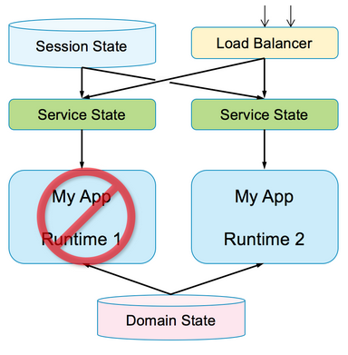

# Kubernetes and istio

## The twelve factors

To effectively design and build apps for the cloud, you should understand the twelve factors:

I. Codebase: One codebase tracked in revision control, many deployments

II. Dependencies: Explicitly declare and isolate dependencies

III. Config: Store configuration in the environment

IV. Backing services: Treat backing services as attached resources

V. Build, release, run: Strictly separate build and run stages

VI. Processes: Execute the app as one or more stateless processes

VII. Port binding: Export services via port binding

VIII. Concurrency: Scale out via the process model

IX. Disposability: Maximize robustness with fast startup and graceful shutdown

X. Dev/prod parity: Keep development, staging, and production as similar as possible

XI. Logs: Treat logs as event streams

XII. Admin processes: Run admin/management tasks as one-off processes

### Codebase

Use one codebase for all the code in your app, which is stored in a revision control system, supporting many deployments. For example, units of deployment could be Docker containers, Cloud Foundry apps, or a TAR file made up of a Helm chart.

Each microservice should have its own project with its own main branch and membership but should all be stored in the same repository.

Tip: To automate deployment, you can use popular tools such as Gradle or Jenkins.

### Dependencies

Explicitly declare and isolate your dependencies. This is common problem for many developers. Build packs take care of many of these dependencies for you. Never rely on systemwide dependencies. Here are typical language-specific configurations:

Node.js: Node Package Manager (npm)
Liberty: Feature manager
Ruby: Bundler
Java EE: Application resources
For example, a Node.js app is described by an npm package file (typically named package.json). Among other configuration details, it lists what other packages this package depends on. The app configuration is part of the app, and you manage the configuration in source control, for example, GitHub.

Another example is the server.xml file for WebSphere Liberty. The server is configured by its server.xml file. In that file, the Feature Manager is configured to enable (or include) the Liberty features that are required by the apps that will run in the server. The server configuration is part of deploying the app, and once again, you manage it in source control.

### Configuration

Store the configuration in the environment, for example, the configuration location of a database in test versus production. The configuration can change, and changes are tracked effectively. Enable the same code to be deployed to different environments:

Store configuration in the environment
Separate configuration from source
Configuration information might include:

Resource handles to databases and other backing services
Credentials to external sources (for example, Twitter)
Per-deploy values (for example, canonical hostname for deployment)
Anything that is likely to vary among deployments (dev, test, stage, prod)
Store the configuration in the environment. Do not store it in these locations:

The code
Properties files (considered part of the code)
The build (one build, many deployments)
The app server (for example, JNDI data sources)
For example, for a containerized application to be deployed to Kubernetes clusters, the configuration can be stored in a YAML file. Among other things, the YAML file specifies the replica sets, networking, and health checks. Again, the container configuration is part of deploying the app, and you manage it in source control for your deployment files.

Here is an example for an nginx server. The Helm values.yaml file exposes a few of the configuration options in the charts, though some are not exposed there. This example file does not include user names or passwords, which exemplifies the statement “…the codebase could be made open source at any moment, without compromising any credentials.

The nginx Helm chart shows how to compose several resources into one chart, and it illustrates more complex template usage. It creates a replica set, a config map, and a service. The replica set starts an nginx pod. The config map stores the files that the nginx server can serve.

### Backing services

Backing services are treated as attached resources. They might be running on the same compute, a different compute, or on third-party hosts. You need to treat these as attached resources that can be bound.

Tips:

Treat the following backing services as attached resources:
Databases
Messaging systems
LDAP servers
Others
Treat local and remote resources identically.

### Build, release, run

Separate the ways in which you build, release, and run apps. A codebase is transformed into a (nondevelopment) deployment through three stages:

Build stage: A transform that converts a code repository into an executable bundle known as a build. Using a version of the code at a commit specified by the deployment process, the build stage fetches dependencies and compiles binaries and assets.

Release stage: Takes the build produced by the build stage and combines it with the deployment’s current config. The resulting release contains both the build and the config and is ready for immediate execution in the execution environment.

Run stage (also known as runtime): Runs the app in the execution environment by launching some set of the app’s processes against a selected release. The runtime code should not be modifiable because there’s no way to put those changes back into the build stage.

### Processes

Run the app as one or more stateless processes. This is one of the most important things to keep in mind when you are trying to build a truly scalable, distributed, cloud-ready app. Because there is no state within a particular process, if you lose a process, it does not matter because the traffic is automatically and seamlessly routed to other processes in the environment that can handle that work.

Tips:

Do not rely on session affinity, also called sticky sessions.
Store state in a stateful backing service that is external to the process.
Runtimes should be stateless, but the services can or do have state.

This graphic illustrates how the state is stored in services and passed into the runtime. The runtime uses the state long enough to perform a unit of work and then throws it away. The runtime does not maintain state between units of work.

Here are a few key details on app state:

Service state:

Data passed into the stateless service
Scope: Transaction or unit of work
Example: Service operation parameters
Session state:

Data for history of a user session
Scope: Session
Example: HTTP session
Domain state:

Data available to multiple or all services
Scope: Global
Example: Enterprise database of record
Usage:

Service state is populated by service client, often from session state
Service state often contains keys, used to retrieve domain state

### Port binding

Export your services with port binding. This action is typically taken care of for developers by the operational and deployment model, but developers need to ensure that they do not hardcode port values. The app should be able to run and connect to services without manually specifying configuration values.

As an example, a web app binds to an HTTP port and listens for requests that come in on that port.

### Concurrency

Use the process model to scale out. Another way to think of this tenet is the concept of horizontal scaling.

Tips:

Scale out, not up, using the process model.
To add capacity, run more instances.
There are limits to how far an individual process can scale.
Stateless apps make scaling simple.
With vertical scaling, you run more instances of the app. One runtime runs more instances, so the runtime requires more CPU and memory, which makes it bigger, and all of the CPU and memory have to belong to a single host.

With horizontal scaling, you run more instances of the app and run more runtimes, which keeps each runtime the same size. More runtimes still require more CPU and memory, but they can be distributed across multiple hosts, so all of the CPU and memory doesn’t need to belong to a single host. The following graphic shows an example of horizontal scaling.

### Disposability

Ensure that processes start fast and gracefully shut down, which means that processors should start almost instantaneously. When you shut them down, there should be no housekeeping or extra work that you must do.

Tips:

App instances are disposable.
Apps should handle shutdown signals or hardware failures with crash-only design.
Note that containers are built on the disposability tenet.
Consider failover. Do not get attached with your runtimes; they are not meant to last forever. Runtimes are immutable, so each is as good as any other. Add or remove them as needed for elasticity. If one dies or becomes unhealthy, kill it, and start another just like it.

This graphic shows how an app can be run in two instances. When one instance is shut down or dies, its load fails over to the remaining instance, such that all the load goes to the remaining instance.

### Development and production parity

Make your development, staging, and production environments as similar as possible. This tenet ties into agile software delivery, continuous integration, and continuous deployment concepts. You do not want development or production to get so out of sync that one does not reflect the other, which means you cannot fix either. You want them to be reasonably similar.

Tips:

- Use the same backing services in each environment, such as deployment toolchains.
- Minimize incompatible elements across environments:
    Backing services
    Tools
    Platforms

Related links https://www.ibm.com/cloud/garage/content/code/practice_continuous_integration/
Getting started with continuous integration https://www.ibm.com/cloud/garage/content/deliver/practice_continuous_delivery/

Building and deploying software through continuous delivery

### Logs

Treat your logs as event streams, meaning that the app does not write or manage log files. Without correct telemetry in your environment, you have no idea what is going on. When complex issues arise, they might be difficult to fix and understand.

Each process writes to stdout:

Apps should not write to specialized log files.
The environment decides how to gather, aggregate, and persist stdout output.
An example of a log tool is the ELK stack (Elasticsearch, Logstash, and Kibana) that streams, stores, searches, and monitors logs.

### Admin processes

Set up processes for your administrative or management tasks, even one-off processes. Do not create admin processes that might be repeated many times that are not well encapsulated as code themselves. It is important to create a process, even if it is a one-off process that does the particular task.

Examples of admin processes:

- Migrate a database
- Create an SQL database:
    DDL script that creates the schema
    SQL script that populates initial data
    Script that runs these scripts as part of creating the database
- Migrate data to a new schema
- Debug
  
When you perform a one-time only admin task, do not assume it will be one-time only. Assume that you will need to run it once per environment (like Dev, Test, and Prod), or per deployment, or each time a problem mysteriously reoccurs. Because you will need to run it repeatedly, make it easily repeatable by making it into a script or program. That executable can be run with a single command, maintained to keep it working, stored in source code management, versioned, and shared with other developers and administrators. Even if it is only ever used once, at least you have a record of what you did.

## What are microservices?

Microservices are an app architectural style that divides an app into components where each component is a full but miniature app that’s focused on producing a single business task according to The Single Responsibility principle.

A microservices design implements tasks from beginning to end: From the GUI to the database, or at least from the service API to the database so that different GUIs and client apps can reuse the same business task functionality. The business task is meaningful to the business users, meaning no technical or infrastructure microservices.

Each microservice has a well-defined interface and dependencies (for example, to other microservices and to external resources) so that the microservice can run fairly independently, and the team can develop it fairly independently.

### Microservices: Making developers more efficient

Microservices are often described in terms of using technology better. But microservices also make developers (not just computers) more efficient.

It does so by enabling them to accomplish meaningful work while working in small teams. Small teams make developers (and people in general) more productive because they spend less time in meetings (and otherwise communicating with and coordinating with others) and more time developing code.

Microservices accelerate delivery by minimizing communication and coordination among people, and reducing the scope and risk of change.

### Microservices architecture

The aim of a microservice architecture is to completely decouple app components from one another such that they can be maintained, scaled, and more.

It’s an evolution of app architecture, service-oriented architecture (SOA), and publishing APIs:

SOA: Focus on reuse, technical integration issues, technical APIs

Microservices: Focus on functional decomposition, business capabilities, business APIs

Microservice architecture as summarized in Martin Fowler’s paper would have been better named micro-component architecture because it is really about breaking apps up into smaller pieces (micro-components). For more information, see Microservices by Martin Fowler. https://martinfowler.com/articles/microservices.html

### Example app that uses microservices

Here’s an example of an app with a microservices architecture that demonstrates business tasks as components.

This example app is for booking airline tickets. The app needs these components:

Logging
Metrics
Health check
Service endpoint
Service registry
Service management
Each of these components is a fairly independent business task that can be developed separately and in priority order. Each means something to the business users and each has quality of service (QoS) targets.

For example, in the following image, you can imagine that an airline booking app has components such as fare calculations, seat allocation, flight rewards programs, and so on.

### Key tenets of a microservices architecture

These tenets test whether the architecture you’re implementing is microservices. The more you’re implementing these qualities into your app, the more you’re on the right track.

- Large monolith architectures are broken down into many small services:
    - Each service runs in its own process.
    - The applicable cloud rule is one service per container.

- Services are optimized for a single function:
    - There is only one business function per service.
    - The Single Responsibility Principle: A microservice should have one, and only one, reason to change.

- Communication is through REST API and message brokers:
    - Avoid tight coupling introduced by communication through a database.

- Continuous integration and continuous deployment (CI/CD) is defined per service:
    - Services evolve at different rates.
    - You let the system evolve but set architectural principles to guide that evolution.

- High availability (HA) and clustering decisions are defined per service:
    - One size or scaling policy is not appropriate for all.
    - Not all services need to scale; others require autoscaling up to large numbers.

### Comparing monolithic and microservices architectures
 
A side-by-side comparison shows the old way of architecting apps and the new way.

